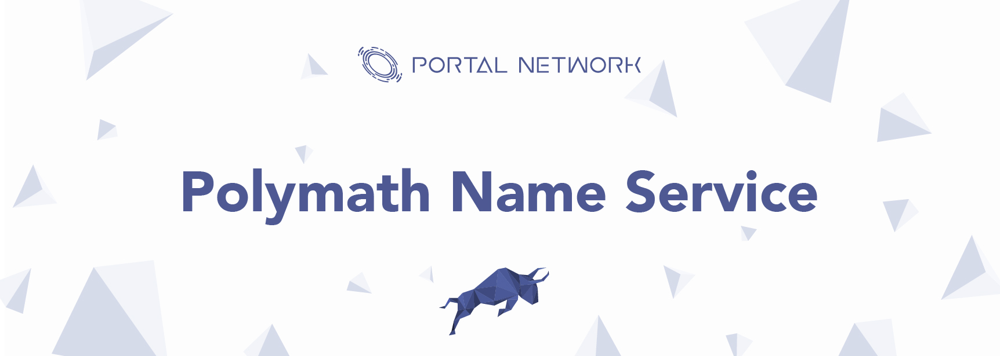

> 📖🔍 Documents of the Polymath Name Service.

# Overview

## 💡 What is Polymath?
Polymath enables trillions of dollars of securities to migrate to the blockchain.

## 💡 What is BNS?
BNS – or blockchain name system – is the protocol on the internet that turns human-comprehensible decentralized website names such as ‘website.poly’ or ‘mywebsite.poly’ into addresses understandable by decentralized network machines.

## 📝 Description
PNS is the Polymath Name Service, a distributed, open, and extensible naming system based on the Polymath blockchain.

## 📚 Documents

#### Table of Contents
-  [Introduction](./docs/INTRODUCTION.md)

## 🔗 Links
- [Official Website](https://polymath.network/)

## 📣 Contributing
See [CONTRIBUTING.md](./CONTRIBUTING.md) for how to help out.

## 🗒 Licence
See [LICENSE](./LICENSE) for details.
